# JanjiCare - Clinic Web Appointment System


<p align="center">
  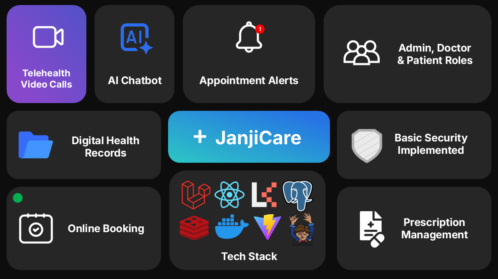
</p>

JanjiCare is a comprehensive, modern clinic web appointment system designed to seamlessly connect administrators, doctors, and patients. Built on a robust tech stack featuring Laravel, React, Inertia.js, and Tailwind CSS, JanjiCare delivers a fluid, single-page application (SPA) experience while maintaining the power and security of a server-side framework.

> [!NOTE]
> This project implements strict role-based access control (RBAC) featuring dedicated dashboards for `admin`, `doctor`, and `patient` accounts.

## Screenshot Gallery

<details>
<summary>Click to view UI Screenshots</summary>

| **Public & Patient Views** | **Doctor & Admin Views** |
| :--- | :--- |
| **Landing Page**<br>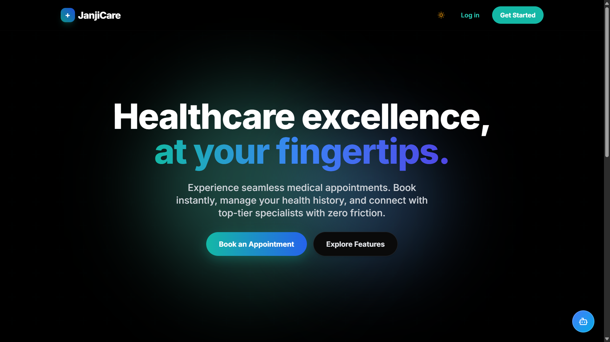 | **Admin Dashboard**<br>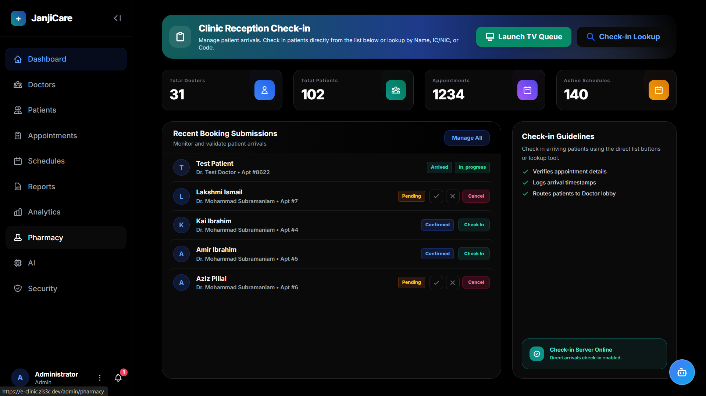 |
| **Patient Booking**<br>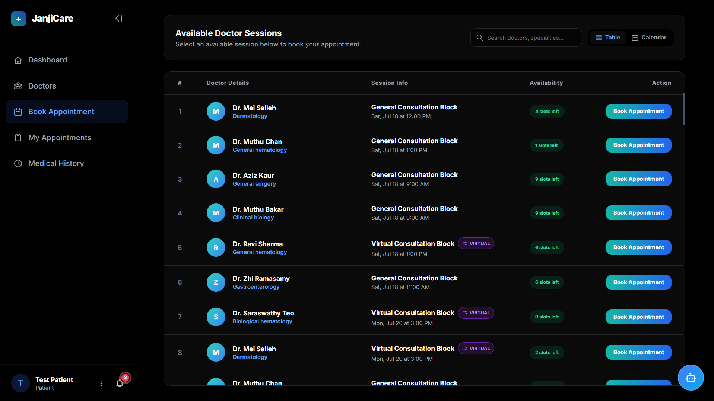 | **Doctor Schedule**<br>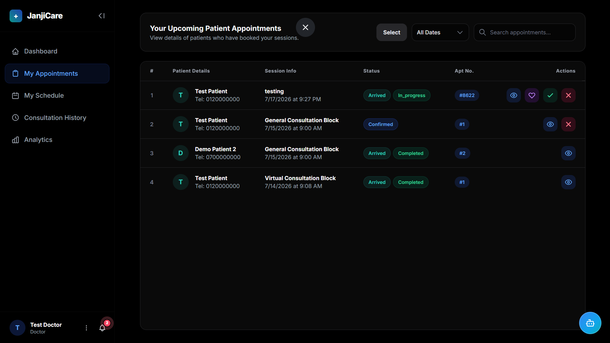 |
| **Secure Authentication**<br>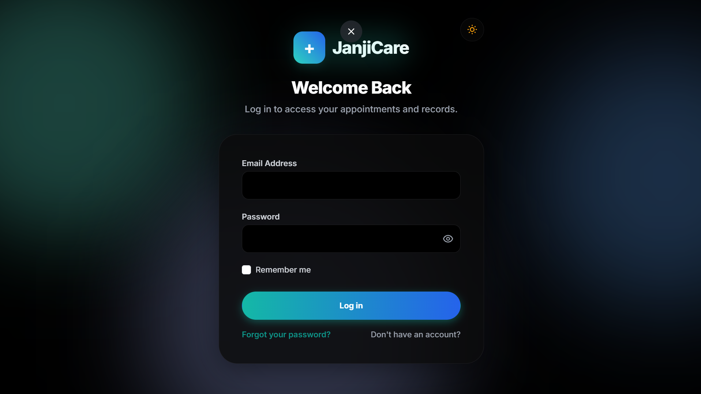 | **Telehealth Room**<br>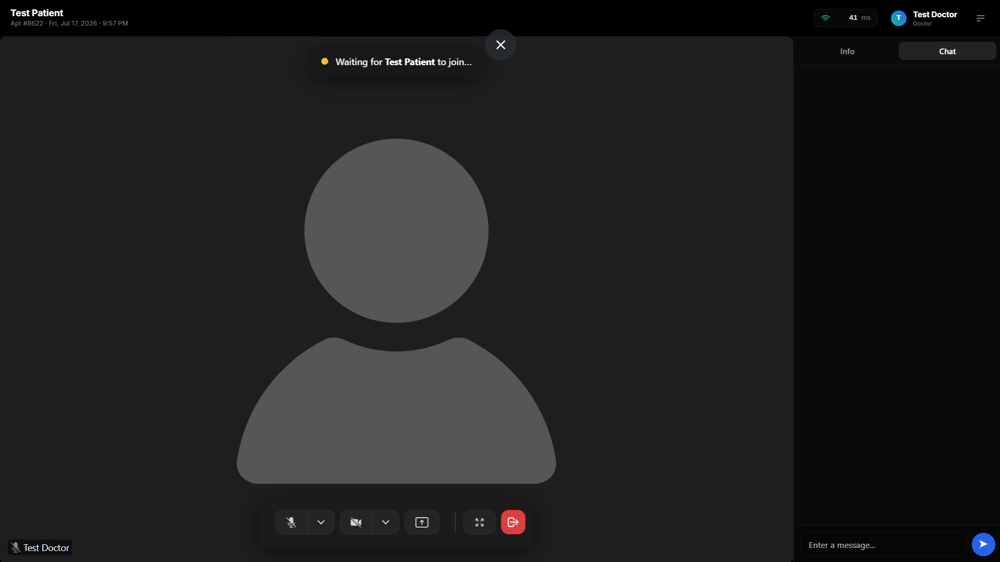 |
| **AI Chatbot Interface**<br>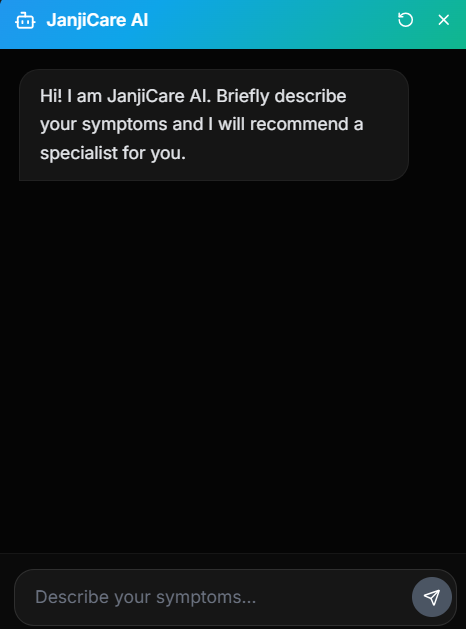 | **Patient Queue**<br>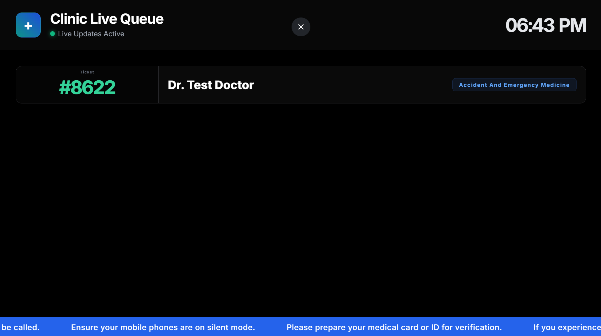 |
| **Doctor Schedule Detailed**<br>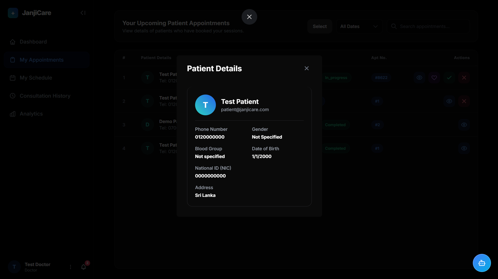 | **Pharmacy & EMR**<br>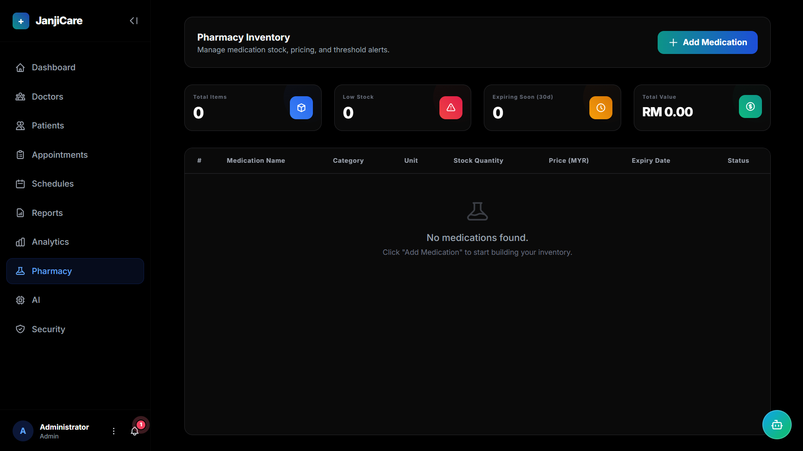 |
| | **Admin Settings (AI Config)**<br>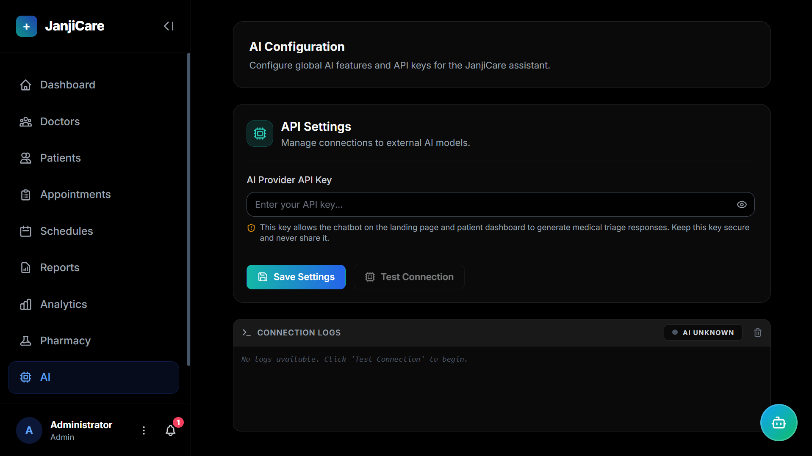 |

</details>

## Role-Based Access Control (3 Distinct Portals)
JanjiCare is built with a strictly separated, multi-tenant architecture to ensure users only see exactly what they need to see.
* **Admin Portal:** Complete oversight of the clinic. Admins can manage doctor and patient accounts, view system-wide analytics, manage schedules, and oversee the pharmacy inventory.
* **Doctor Portal:** A streamlined workspace for medical professionals. Doctors can view their upcoming appointments, manage their schedules, review patient Electronic Medical Records (EMR), write digital prescriptions, and launch secure telehealth video calls.
* **Patient Portal:** A highly accessible interface for patients to easily book appointments, access their medical history and prescriptions, and join virtual consultation rooms from any device.

## Secure by Design
Because JanjiCare handles sensitive medical data and appointments, security is implemented at every layer of the application:
* **Secure WebRTC Telehealth:** Video and audio streams are handled via LiveKit, requiring securely signed, time-limited JWT tokens generated server-side. No unauthorized users can ever enter a consultation room.
* **Route Protection & Middleware:** Every single API endpoint and Inertia page is strictly guarded by Laravel's robust authentication middleware, ensuring patients cannot access doctor endpoints and vice-versa.
* **Credential Protection:** All sensitive credentials, database passwords, and WebRTC secret keys are strictly excluded from the codebase and managed entirely through environment variables to prevent accidental exposure on GitHub.
* **CSRF & XSS Prevention:** Out-of-the-box protection against Cross-Site Request Forgery and Cross-Site Scripting, baked deeply into the Laravel and React/Inertia stack.

## Additional Core Features

* **Smart Scheduling**: Conflict-safe calendar slot validation and dynamic availability management for medical professionals.
* **Live Patient Queue**: Real-time waiting room updates and check-in workflows using Laravel Reverb.
* **Clinical Records**: Capture medical notes, diagnoses, and digital prescriptions securely during consultations.
* **Notification Engine**: In-app alert system with unread counts, status updates, and history tracking.
* **AI Provider Integration**: Configure external AI models (e.g. Gemini) via a dedicated Admin interface with real-time connection logging and status tracking.
* **Advanced Analytics**: Interactive charts and data exports (PDF) for tracking clinic performance and appointment volumes.
* **Modern UI/UX**: Fully responsive, accessible, and themeable interface (including Dark Mode) built with Tailwind CSS.

## Tech Stack

**Backend**
- [Laravel 13](https://laravel.com/)
- [PHP 8.3+](https://www.php.net/)
- MySQL / PostgreSQL

**Frontend**
- [React 18](https://reactjs.org/)
- [Inertia.js](https://inertiajs.com/)
- [Tailwind CSS 3](https://tailwindcss.com/)
- [TypeScript](https://www.typescriptlang.org/)
- [Chart.js](https://www.chartjs.org/)

## Getting Started

> **Detailed Setup Guide:** For an in-depth walkthrough of setting up the environment, database, and production deployments, please see our comprehensive [Installation Guide](INSTALLATION.md).

Follow these quick steps to get a local copy of JanjiCare up and running.

### Prerequisites

* PHP >= 8.3
* Composer
* Node.js & npm
* A relational database (MySQL/PostgreSQL)

### Installation

1. **Clone the repository**
   ```bash
   git clone https://github.com/your-org/clinic-web-appointment-system.git
   cd "Clinic Web Appointment System/clinic-app"
   ```

2. **Install PHP dependencies**
   ```bash
   composer install
   ```

3. **Install JavaScript dependencies**
   ```bash
   npm install
   ```

4. **Environment Setup**
   Copy the example environment file and generate a new application key.
   ```bash
   cp .env.example .env
   php artisan key:generate
   ```

5. **Database Configuration**
   Update your `.env` file with your database credentials, then run the database migrations and seeders (to generate default roles and test data).
   ```bash
   php artisan migrate --seed
   ```

6. **WebSockets & Telehealth (LiveKit) Setup**
   JanjiCare uses Laravel Reverb for real-time notifications and LiveKit for high-quality WebRTC video consultations.
   ```bash
   # Start the WebSocket server
   php artisan reverb:start

   # (Optional) Start local LiveKit Server using the provided docker-compose
   cd .. # Move to project root
   docker-compose -f livekit-docker-compose.yml up -d
   ```
   *Make sure your `.env` contains your LiveKit credentials (`LIVEKIT_URL`, `LIVEKIT_API_KEY`, `LIVEKIT_API_SECRET`).*

7. **Run the Application**
   Launch the backend server and frontend build pipeline concurrently.
   ```bash
   php artisan serve
   npm run dev
   ```
   *Alternatively, use `composer run dev` if configured in your environment.*

### Production Notes

* The deploy flow keeps the plain `users.role` column and Spatie roles in sync by running `php artisan roles:sync` after migrations.
* When `MAIL_MAILER=log` is used for fake or test inboxes, email verification OTPs and staff 2FA codes are written to `storage/logs/laravel.log`.
* If you switch to a real SMTP provider later, only change the mail transport env vars. The login and verification flows stay the same.
* Demo seed accounts use `@janjicare.com` addresses and the shared password `p@5wo0rd`.

## Project Structure

```text
Clinic Web Appointment System/
├── .github/                 # GitHub workflows and issue/PR templates
├── livekit-docker-compose.yml # Docker config for local LiveKit server
├── livekit.yaml             # LiveKit configuration file
├── deploy.ps1               # Automated deployment script to VPS
├── INSTALLATION.md          # Comprehensive setup instructions
└── clinic-app/              # Main Laravel Application
    ├── app/
    │   ├── Http/Controllers/  # Logic controllers (Admin, Doctor, Patient, API)
    │   ├── Models/            # Eloquent models (User, Appointment, Schedule, etc.)
    │   ├── Notifications/     # Email and database alerts
    │   └── Policies/          # Authorization and role-based access logic
    ├── config/              # Application, database, and service configurations
    ├── database/
    │   ├── migrations/      # Version-controlled database schemas
    │   └── seeders/         # Dummy data generation (RealtimeDataSeeder)
    ├── resources/
    │   ├── css/             # Global Tailwind styles
    │   └── js/
    │       ├── Components/  # Reusable React UI components (Buttons, Inputs, etc.)
    │       ├── Layouts/     # Shared application layouts (Sidebar, Guest)
    │       └── Pages/       # Inertia.js React views
    │           ├── Admin/      # System overview, AI settings, analytics
    │           ├── Doctor/     # Doctor schedule, patients, appointments
    │           ├── Patient/    # Patient dashboard, booking, history
    │           ├── Telehealth/ # WebRTC Room component (LiveKit)
    │           └── Auth/       # Login, Registration, 2FA views
    ├── routes/
    │   ├── web.php          # Inertia routes and web endpoints
    │   ├── api.php          # Stateless API routes
    │   ├── channels.php     # Reverb WebSocket broadcast channels
    │   └── auth.php         # Authentication routes
    └── tests/               # PHPUnit feature and unit tests (100+ tests)
```

## Contributing

We welcome contributions from the community! Please read our [Contributing Guidelines](CONTRIBUTING.md) to get started. By participating in this project, you agree to abide by our [Code of Conduct](CODE_OF_CONDUCT.md).

## Security

If you discover any security-related issues, please refer to our [Security Policy](SECURITY.md) for information on how to responsibly disclose vulnerabilities.

## License

This project is licensed under the MIT License. See the [LICENSE](LICENSE) file for more details.
